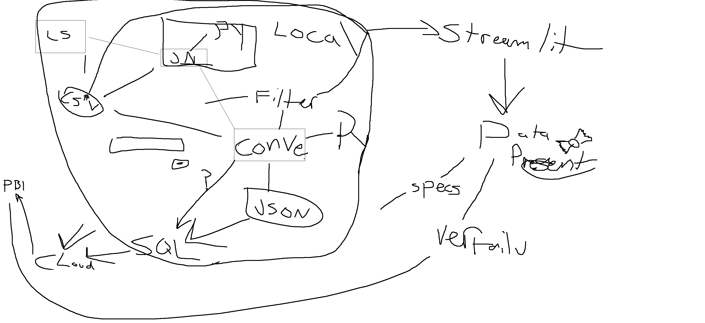
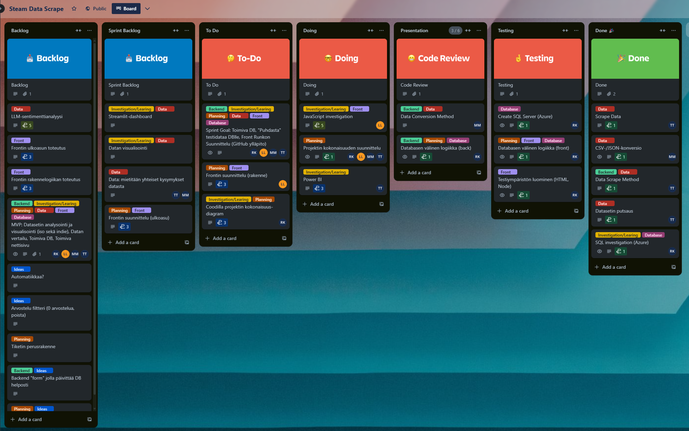

# SteamData®

  

**Roy Koljonen**
**Lari Lindberg**
**Mikko Mononen**
**Tommi Tammelin**

**October 2024**

## _"SteamData" is not really a registered trademark_

---

#### Original Goals:

- Gather, analyze and visualize indie game data for recognizing trends.

#### Final Product:

- Cloud server with database structured to handle game information efficiently.
- Web interface allows users to filter and search for games, with results dynamically displayed based on user input.
- Backend app for importing, validating and filtering data with bulk data insertion to the database.
- Data analysis and visualisation.
- LLM sentiment analysis.

---

#### Project Diagram

https://mmononen.github.io/steamdata/

---

#### Initial Planning

---

#### OOS Ideas:
- Backend app Steam API integration.
- Whole dataset and indie games dataset comparison.
- Branch ID

#### Future Ideas:
- More tools for the front end user.
- Data analysis visualization at front end.
- Automated database update.