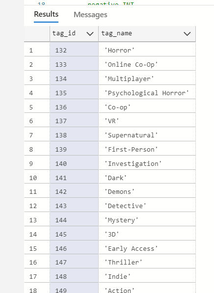

<style scoped>
  h1 {
    margin-top: 50px;
  }
  .bottom-align {
    position: absolute;
    bottom: 60px;
  }
</style>

# SteamData®

_Database Design, Data Integration and Application Development_

<br></br>
<span class="sub-title">**Roy Koljonen**</span>
<span class="sub-title">**October 2024**</span>

## <span class="bottom-align tiny-text">_"SteamData" is not really a registered trademark_</span>

---

<style scoped>
  h3 {
    font-size: 1.5em;
  }
  h6 {
    font-size: .8em;
  }
</style>

### Introduction
###### My Project Goals:

<br>

<div style="display: flex; justify-content: space-between;">
<div style="width: 31%; font-size: .8em;">

**Azure Cloud Database**
Implement and maintain a cloud database for storing game data.

</div>
<div style="width: 31%; font-size: .8em;">

**Back-End Development**
Develop the back-end system for managing and integrating game data with the database.

</div>
<div style="width: 31%; font-size: .8em;">

**Front-End Design**
Create a web interface for users to search, filter, and view game data.

</div>
</div></div>

---

<style scoped>
    h2 {
    margin-top: -20px;
    font-size: .8em;
    }
    section {
        text-align: center;
    }
    img.diagram {
        max-width: 100%;
        margin: 0 auto;
    }
</style>

## Database Table Reference Diagram


---

<style scoped>
  h4 {
    font-size: 0.75em;
    margin-top: -10px;
  }
</style>

<div style="display: flex; justify-content: space-between;">
<div style="width: 48%;">

#### SQL Commands

```sql
CREATE TABLE indie_games (
    AppID INT PRIMARY KEY,
    name VARCHAR(255) NOT NULL,
    release_date DATE,
    price DECIMAL(10, 2),
    metacritic_score INT,
    recommendations INT,
    positive INT,
    negative INT,
    estimated_owners VARCHAR(255),
    average_playtime_forever INT,
    peak_ccu INT,
    pct_pos_total DECIMAL(5, 2),
    num_reviews_total INT
);

CREATE TABLE tags (
    tag_id INT PRIMARY KEY AUTO_INCREMENT,
    tag_name VARCHAR(255) NOT NULL
);

CREATE TABLE game_tags (
    AppID INT,
    tag_id INT,
    PRIMARY KEY (AppID, tag_id),
    FOREIGN KEY (AppID) REFERENCES indie_games(AppID) ON DELETE CASCADE,
    FOREIGN KEY (tag_id) REFERENCES tags(tag_id) ON DELETE CASCADE
);
```
</div> 

<div style="width: 48%;">

#### Many-to-Many Relationships

<div style="font-size: 0.5em;">

- **`game_tags` Table**: 
  - Establishes a **many-to-many relationship** between games and tags (same for genres and categories).
  - A single game can have multiple tags, and a single tag can apply to multiple games.

- **Example**:
  - **Game "A"** with `AppID = 1` is tagged as **"Indie"** and **"Horror"**.
  - **"Indie"** has `tag_id = 1`, and **"Horror"** has `tag_id = 2`.
  - The `game_tags` table will contain:
    - `(AppID = 1, tag_id = 1)` for the **"Indie"** tag.
    - `(AppID = 1, tag_id = 2)` for the **"Horror"** tag.

- **Foreign Key Constraints**: 
Ensure that each `AppID` in `game_tags` exists in `indie_games`, and each `tag_id` exists in `tags`.

- **Cascade Deletion**: 
Automatically removes linked entries in `game_tags` when a game or tag is deleted.

</div></div></div>

---

**`indie_games`**:
  

<div style="display: flex; justify-content: space-between;">
<div style="width: 48%;">

**`tags`**:
  

</div>

<div style="width: 48%;">

**`game_tags`**:
  

</div></div>

---

<style scoped>
    h2 {
    text-align: center;
    font-size: 0.7em;
    margin-top: -30px;
    }
    img.diagram {
        max-width: 100%;
        margin: 0 auto;
    }
</style>


## Back End Application Architecture Diagram

<div style="display: flex; justify-content: space-between;">
<div style="width: 20%; text-align: right; font-size: 0.4em;">

### Key Components:
<br>

#### Validation Module
Validates and compares imported data with database entries.

Ensures there are no duplicate entries.
Cross-references tags, genres, and categories.
<br>
#### Filtering Module
Filters data before pushing to the database or exporting.

Supports filtering by name, genre, tag, and date.
Prepares the final data for upload/export.
<br>
#### Database Module
Manages the interactions with the Azure Cloud Database.

Sends filtered data to the database in batches, optimizing performance.

</div>

<div style="width: 79%;">


</div></div>

---

<style scoped>
  h4 {
    margin-top: -70px;
    }
  img.validate {
    max-width: 50%;
    margin-top: -20px;
  }
</style>

<div style="text-align: right;">
    
</div>

<div style="display: flex; justify-content: space-between;">
<div style="width: 49%; font-size: .54em;">

#### Validation Module:

- Loops through imported data, validates each game, and updates the view with valid entries.
- Logs progress and statistics (valid, invalid, duplicate).
- Basic validation by checking required fields `AppID`, `Name` and comparing key fields (tags, price, reviews, etc.) with the database.
- If all fields match, it's marked as a duplicate.
- Returns `Valid`, `Invalid` or `Duplicate` status.

```C#
foreach (var importedGame in importGames.ToList())
    {
        var dbGame = dbGames.FirstOrDefault(g => g.AppID == importedGame.AppID);
        var result = ValidateGameData(importedGame, dbGame);
        rowCounter++;

        switch (result)
        {
            case ValidationResult.Valid:
                validGames.Add(importedGame);
                validCounter++;
                break;
            case ValidationResult.Invalid:
                invalidCounter++;
                break;
            case ValidationResult.Duplicate:
                duplicateCounter++;
                break;
        }
...
```

</div>

<div style="width: 49%;">

```C#
public ValidationResult ValidateGameData(Game importedGame, Game dbGame)
{
    if (importedGame.AppID <= 0 || string.IsNullOrEmpty(importedGame.Name))
    { return ValidationResult.Invalid; }

    if (dbGame == null)
    { return ValidationResult.Valid; }

    var sortedImportedTags = importedGame.Tags.OrderBy(t => t).ToList();
    var sortedDbTags = dbGame.Tags.OrderBy(t => t).ToList();
    var sortedImportedGenres = importedGame.Genres.OrderBy(g => g).ToList();
    var sortedDbGenres = dbGame.Genres.OrderBy(g => g).ToList();
    var sortedImportedCategories = importedGame.Categories.OrderBy(c => c).ToList();
    var sortedDbCategories = dbGame.Categories.OrderBy(c => c).ToList();

    if (
        sortedImportedTags.SequenceEqual(sortedDbTags) &&
        sortedImportedGenres.SequenceEqual(sortedDbGenres) &&
        sortedImportedCategories.SequenceEqual(sortedDbCategories) &&
        importedGame.Price == dbGame.Price &&
        importedGame.ReleaseDate == dbGame.ReleaseDate &&
        importedGame.MetacriticScore == dbGame.MetacriticScore &&
        importedGame.Recommendations == dbGame.Recommendations &&
        importedGame.Positive == dbGame.Positive &&
        importedGame.Negative == dbGame.Negative &&
        importedGame.EstimatedOwners == dbGame.EstimatedOwners &&
        importedGame.AveragePlaytime == dbGame.AveragePlaytime &&
        importedGame.PeakCcu == dbGame.PeakCcu &&
        importedGame.PctPosTotal == dbGame.PctPosTotal &&
        importedGame.NumReviews == dbGame.NumReviews)
    { return ValidationResult.Duplicate; }

    return ValidationResult.Valid;
}
```

</div></div>

---

<style scoped>
  h4 {
    margin-top: -20px;
  }
  img.filter {
        max-width: 75%;
        margin-top: -20px;
  }
</style>

<div style="text-align: right;">

</div>

<div style="display: flex; justify-content: space-between;">
<div style="width: 49%; font-size: .56em;">

#### Filter Module:
- Retrieves user inputs for name, genre/tag, and date range filters.
- Constructs a dynamic filter list based on the entered criteria:
  - **Name filter** checks for partial matches in the `Name` field.
  - **Genre/Tag filter** checks for matches in both the `Tags` and `Genres` fields.
  - **Date filter** ensures the `release_date` falls within the selected range.
- Joins the filter conditions with "AND" to form the final query.
- Applies the filter to the **`DataView`** (`gameView.RowFilter`) to display matching results in the `DataGridView`.
- Updates the row count label with the number of visible rows.
- Refreshes the `importGames` list with the filtered results.


</div>

<div style="width: 49%;">

```C#
private void ApplyFilters()
{
    string nameFilter = txtNameFilter.Text.ToLower();
    string genreTagFilter = txtGenreTagFilter.Text.ToLower();
    DateTime startDate = startDatePicker.Value.Date;
    DateTime endDate = endDatePicker.Value.Date;

    var filterList = new List<string>();

    if (!string.IsNullOrEmpty(nameFilter))
      { filterList.Add($"(Name LIKE '%{nameFilter}%')"); }

    if (!string.IsNullOrEmpty(genreTagFilter))
        { filterList.Add(
            $"(Tags LIKE '%{genreTagFilter}%'" + 
            $"OR Genres LIKE '%{genreTagFilter}%')"); }

    filterList.Add(
      $"(release_date >= #{startDate:yyyy-MM-dd}#" + 
      $"AND release_date <= #{endDate:yyyy-MM-dd}#)");

    gameView.RowFilter = string.Join(" AND ", filterList);

    int visibleRowCount = gameView.Count;
    rowCountLabel.Text = $"Imported row count: {visibleRowCount}";

    UpdateImportGamesList();
}
```

</div>
</div>

---

<style scoped>
  h4 {
    margin-top: 10px;
  }
  img.batch_push {
        max-width: 50%;
        margin-top: -20px;
  }
</style>

<div style="text-align: right;">

</div>

<div style="display: flex; justify-content: space-between;">

<div style="width: 39%; margin-top: -100px;" class="code-block">

```C#
var insertGameValues = new StringBuilder();
foreach (var game in games)
{
    string name = game.Name.Replace("'", "''");
    insertGameValues.Append($@"(
    {game.AppID}, 
    '{name}', 

    // All other values

    {game.NumReviews} ),");
}

if (insertGameValues.Length > 0)
    { insertGameValues.Length--; }

string indieGameInsertQuery = $@"
  INSERT INTO indie_games (
      AppID,
      name, 
      
      // All other values

      num_reviews_total
  ) VALUES 
  {insertGameValues.ToString()}
  ON DUPLICATE KEY UPDATE
      name = VALUES(name),

      // All other values

      num_reviews_total = VALUES(num_reviews_total);";

using (var cmd = new MySqlCommand(indieGameInsertQuery, connection, transaction))
{ await cmd.ExecuteNonQueryAsync(); }

await InsertCategoriesBatchAsync(games, connection, transaction);
await InsertGenresBatchAsync(games, connection, transaction);
await InsertTagsBatchAsync(games, connection, transaction);

await transaction.CommitAsync();
}
...
```

</div>

<div style="width: 55%; font-size: 0.6em;">
<br>

#### SQL Bulk Insert Logic

- **Bulk Query Construction**:  
   A `StringBuilder` concatenates values for all games in the `games` list, forming a bulk `INSERT` query.

- **Optimized SQL Execution**:  
   Executes the bulk query in one SQL command. The `ON DUPLICATE KEY UPDATE` clause updates records if they already exist (matching `AppID`).

- **Transaction & Error Handling**:  
   Wraps the entire process in one transaction to ensure all operations either succeed or are rolled back on error.

- **Inserting Related Data**:  
   After games, categories, genres, and tags are also inserted into their tables in batches for efficiency.

</div>
</div>

---
<style scoped>
  h4 {
      font-size: 0.75em;
      margin-top: -20px;
  }
  li {
    font-size: 0.5em; 
  }
</style>


<div style="display: flex; justify-content: space-between;">
<div style="width: 49%;">


#### Insert Tags (and Genres & Categories):

<div style="margin-top: -20px";>

- Loops through each game and its tags.
- For each tag, retrieves or inserts the tag ID using `GetOrInsertTagAsync`.
- Builds a bulk insert query to add tags in batches.
- Executes the query to insert all game-tag pairs at once.
- Avoids inserting duplicate entries using `ON DUPLICATE KEY UPDATE`.

</div>

```csharp
private async Task InsertTagsBatchAsync(
  List<Game> games, MySqlConnection connection, MySqlTransaction transaction)
{
    var tagValues = new StringBuilder();
    foreach (var game in games)
    {
        foreach (var tag in game.Tags)
        {
            int tagId = await GetOrInsertTagAsync(tag, connection, transaction);
            tagValues.Append($"({game.AppID}, {tagId}),");
        }
    }
    if (tagValues.Length > 0)
        { tagValues.Length--; }

    string gameTagInsertQuery = $@"
        INSERT INTO game_tags (AppID, tag_id) VALUES 
        {tagValues.ToString()}
        ON DUPLICATE KEY UPDATE tag_id = VALUES(tag_id);";

    using (var cmd = new MySqlCommand(gameTagInsertQuery, connection, transaction))
    { await cmd.ExecuteNonQueryAsync(); }
}
```

</div>

<div style="width: 49%;">


#### Get or Insert Tag:

<div style="margin-top: -20px";>

- Retrieves the tag ID from the database or inserts a new tag if it doesn't exist.
- Uses a `tagCache` dictionary to store tag IDs, minimizing repeated database queries.
- Steps:
  - First, check if the tag exists in the cache.
  - If not, execute a `SELECT` query to find the tag in the `tags` table.
  - If the tag is found, return its ID.
  - If not, insert the tag into the database and retrieve its ID using `LastInsertedId`.
  - Add the tag and its ID to the cache for future lookups.

</div>
<div style="margin-top: -14px";>

```csharp
private async Task<int> GetOrInsertTagAsync(
  string tag, MySqlConnection connection, MySqlTransaction transaction)
{
    if (tagCache.TryGetValue(tag, out int tagId))
    { return tagId; }
    string selectQuery = "SELECT tag_id FROM tags WHERE tag_name = @TagName";
    using (var cmd = new MySqlCommand(selectQuery, connection, transaction))
    {
        cmd.Parameters.AddWithValue("@TagName", tag);
        var result = await cmd.ExecuteScalarAsync();
        if (result != null)
        { tagId = Convert.ToInt32(result); }
        else
        {
            string insertQuery = "INSERT INTO tags (tag_name) VALUES (@TagName)";
            using (var insertCmd = new MySqlCommand(insertQuery, connection, transaction))
            {
                insertCmd.Parameters.AddWithValue("@TagName", tag);
                await insertCmd.ExecuteNonQueryAsync();
                tagId = (int)insertCmd.LastInsertedId;
            }
        }
    }
    tagCache[tag] = tagId;
    return tagId;
}
```

</div>
</div></div>

---

<style scoped>
  h4 {
    font-size: 0.8em;
    margin-top: -20px;
  }
  .front {
    width: auto;
    height: 380px;
  }
</style>

#### Front-End Web Design

<div style="font-size: 0.65em;">

- Web Interface:
  - Simple design allowing users to search, filter, and view game data.

- Data Presentation:
  - Data is presented in tables with dynamic filtering options.
  - Individual game details for insights into specific titles.

</div>

<div style="text-align: center;">
  
</div>

---

<style scoped>
  h4 {
    font-size: 0.8em;
    margin-top: -20px;
  }
  .frontSvg {
    width: 100%;
  }
</style>

<div style="display: flex; justify-content: space-between;">
<div style="width: 49%;">

<div style="text-align: center;">
  
</div>

</div>

<div style="width: 49%;">

#### Workflow:

<div style="font-size: 0.8em;">

- **User Interface**: Users search/filter games on the front-end.
- **Search & Filter**: Filters are passed to the backend, processed by the API.
- **API**: Retrieves data from the database based on filter conditions.
- **Database**: Stores and fetches game data (genres, tags, etc.).
- **Data Presentation**: Filtered results are displayed on the UI.
- **Game Details Page**: Users can view detailed information for a selected game.

</div>
</div>

---

<style scoped>
  h4 {
    font-size: 0.8em;
    margin-top: -20px;
  }
  .frontSvg {
    width: 100%;
  }
</style>

<div style="display: flex; justify-content: space-between;">
<div style="width: 49%;">

#### HTML & Styles:

<div style="font-size: 0.9em;">

- **Search fields** for AppID, Name, Category, Genre, and Tags are arranged in a **grid layout**.
- The **search button** triggers the `search()` function, sending user input values for filtering.
- Designed with **responsive CSS grid**, adjusting the layout to fit various screen sizes.

</div>

</div>

<div style="width: 49%; margin-top: -60px;">

```html
  <body>
    <h1>Indie Game Database</h1>
    <p>Filter for indie games released after the year 2020</p>

    <div class="search-grid">
      <div class="grid-item">
        <label for="appid">AppID:</label>
        <input type="number" id="appid" placeholder="Enter AppID" />
      </div>
...
    <div class="search-button">
      <button onclick="search()">Search</button>
    </div>
...
```

```css
.search-grid {
  display: grid;
  grid-template-columns: repeat(auto-fit, minmax(200px, 1fr));
  gap: 20px;
  margin-bottom: 20px;
}

button {
  padding: 10px 20px;
  margin: 5px 0;
  background-color: #2a475e;
  color: #e6e7e8;
  border: none;
  border-radius: 4px;
  cursor: pointer;
  transition: background-color 0.3s;
}
```

</div>

---

<style scoped>
  h4 {
    font-size: 0.8em;
    /* margin-top: -20px; */
  }
</style>

<div style="display: flex; justify-content: space-between;">
<div style="width: 49%;">

#### `search()` Function:

<div style="font-size: 0.8em;">

- **Collects input values** from various fields like AppID, Name, Category, Genre, and Tag.
- Creates **query parameters** dynamically based on the fields filled by the user.
- Makes a **GET request** using `fetch()` to send the parameters to the backend.

</div>
</div>

<div style="width: 49%;">

```js
function search() {
  const appId = document.getElementById('appid').value;
  const name = document.getElementById('name').value;
  const category = document.getElementById('category').value;
  const genre = document.getElementById('genre').value;
  const tag = document.getElementById('tag').value;

  const queryParams = new URLSearchParams();

  if (appId) queryParams.append('appid', appId);
  if (name) queryParams.append('name', name);
  if (category) queryParams.append('category', category);
  if (genre) queryParams.append('genre', genre);
  if (tag) queryParams.append('tag', tag);

  fetch(`/api/games?${queryParams.toString()}`)
    .then((response) => response.json())
    .then((data) => displayGames(data))
    .catch((error) => console.error('Error:', error));
}
```

</div></div>

---

<style scoped>
  h4 {
    font-size: 0.8em;
    margin-top: -20px;
  }
</style>


<div style="display: flex; justify-content: space-between;">
<div style="width: 49%;">

#### Game Search API

<div style="font-size: 0.6em;">

- `api/games` route handles search requests for games based the query parameters.
- The API handles the many-to-many junction tables with `searchGames()`.
- If filters are provided, it calls searchGames.
- `searchGames()` builds a dynamic SQL query based on filters and joins related tables.
- Executes the query and returns matching results.

</div>

```js
app.get('/api/games', (req, res) => {
  const { limit = 10, name, category, genre, tag } = req.query;

  if (name || category || genre || tag) {
    searchGames({ name, category, genre, tag }, (err, games) => {
      if (err) return res.status(500).json({ error: err.message });
      res.json(games);
    });
  } else {
    fetchAllGames(parseInt(limit), (err, games) => {
      if (err) return res.status(500).json({ error: err.message });
      res.json(games);
    });
  }
});
```

</div>

<div style="width: 49%;">

```js
function searchGames(filters, callback) {
    const { name, category, genre, tag } = filters;
    let query = 
      `SELECT ig.appid, ig.name, ig.release_date, ig.price,
        GROUP_CONCAT(DISTINCT c.category_name ORDER BY c.category_name) AS categories,
        GROUP_CONCAT(DISTINCT g.genre_name ORDER BY g.genre_name) AS genres,
        GROUP_CONCAT(DISTINCT t.tag_name ORDER BY t.tag_name) AS tags
      FROM indie_games ig
        LEFT JOIN game_categories gc ON ig.appid = gc.appid
        LEFT JOIN categories c ON gc.category_id = c.category_id
        LEFT JOIN game_genres gg ON ig.appid = gg.appid
        LEFT JOIN genres g ON gg.genre_id = g.genre_id
        LEFT JOIN game_tags gt ON ig.appid = gt.appid
        LEFT JOIN tags t ON gt.tag_id = t.tag_id
      WHERE 1=1`;
    const queryParams = [];

    if (name) {
        query += ` AND ig.name LIKE ?`;
        queryParams.push(`%${name}%`);
    }
    if (category) {
        query += ` AND c.category_name LIKE ?`;
        queryParams.push(`%${category}%`);
    }
    if (genre) {
        query += ` AND g.genre_name LIKE ?`;
        queryParams.push(`%${genre}%`);
    }
    if (tag) {
        query += ` AND t.tag_name LIKE ?`;
        queryParams.push(`%${tag}%`);
    }

    query += ` GROUP BY ig.appid;`;

    connection.query(query, queryParams, callback);
}
```

</div>

---

<style scoped>
  h4 {
    font-size: 0.8em;
    /* margin-top: -20px; */
  }
</style>


<div style="display: flex; justify-content: space-between;">
<div style="width: 49%;">

#### Games List Display

<div style="font-size: 0.6em;">

- `displayGames()` parses and formats the data.
- Generates HTML structure for each game by creating a div element containing the game’s title, metadata and a details table.
- The results are inserted into `index.html`:

  ```html
  <div id="result">
      <!-- Game results will be inserted here -->
  </div>
  ```
  

</div>
</div>

<div style="width: 49%;">

```js
function displayGames(games) {
  const resultDiv = document.getElementById('result');
  resultDiv.innerHTML = '';

  if (!games || games.length === 0) {
    resultDiv.innerHTML = '<p>No games found.</p>';
    return;
  }

  const parseAndFormat = (text) => { ...
  const createLinks = (text, type) => { ...

  return text
    .split(',')
    .map((item) => {
      const formattedItem = item.replace(/'/g, '').trim();
      return `<a href="${baseUrl}${encodeURIComponent(formattedItem)}"
      target="_blank"style="color: #008CFF;"> ${formattedItem}</a>`;}).join(' / ');
  };

  games.forEach((game) => {
    const gameDiv = document.createElement('div');
    gameDiv.className = 'game-result';
    const titleDiv = document.createElement('div');
    titleDiv.className = 'game-title';
    titleDiv.innerHTML = `
            <a href="https://store.steampowered.com/app/${game.appid}" 
            target="_blank" style="color: #008CFF; font-size: 1.5em; 
            font-weight: bold;"> ${game.name || 'Unknown Name'}</a>`;
    gameDiv.appendChild(titleDiv);

    const metaDiv = document.createElement('div');
    metaDiv.className = 'game-meta';
    metaDiv.innerHTML = `
            <div><strong>Categories:</strong> ${parseAndFormat(game.categories)}</div>
            <div><strong>Genres:</strong> ${createLinks(game.genres, 'genre')}</div>
            <div><strong>Tags:</strong> ${createLinks(game.tags, 'tag')}</div>`;
    gameDiv.appendChild(metaDiv);
    const detailsTable = document.createElement('table');
    detailsTable.className = 'game-details';
    detailsTable.innerHTML = `
            <tr><td><strong>Release:</strong></td><td>${game.release_date ? new Date(game.release_date)
              .toLocaleDateString() : 'N/A'}</td></tr>
            <tr><td><strong>Price:</strong></td><td>$${game.price || 'N/A'}</td></tr>
            
            // All other columns

            <tr><td><strong># Reviews:</strong></td><td>${game.num_reviews_total || '0'}</td></tr>`;
    
    gameDiv.appendChild(detailsTable);
    resultDiv.appendChild(gameDiv);
  });
}
```

</div>

---

#### Summary of Future Enhancements

<div style="display: flex; justify-content: space-between; font-size: 0.8em; margin-top: 20px;">
<div style="width: 49%;">

#### Backend:

- Current app has bugs and needs further debugging.
- Potential future enhancements:
  - Automatic database updates from the Steam API.
  - Optimization of inserts and data retrieval.
  - More robust filtering and data handling modules.

</div>

<div style="width: 49%;">

#### Frontend:

- Potential future features:
  - Sorting options for displayed data.
  - Enhanced filtering for better user experience.
  - Tools for user-driven analysis and sentiment analysis using LLMs.

</div></div>

---

<div style="text-align: center;">

<br>
<br>
<br>

## <span class="bottom-align tiny-text">_Thank you_</span>

# Questions?


</div>

