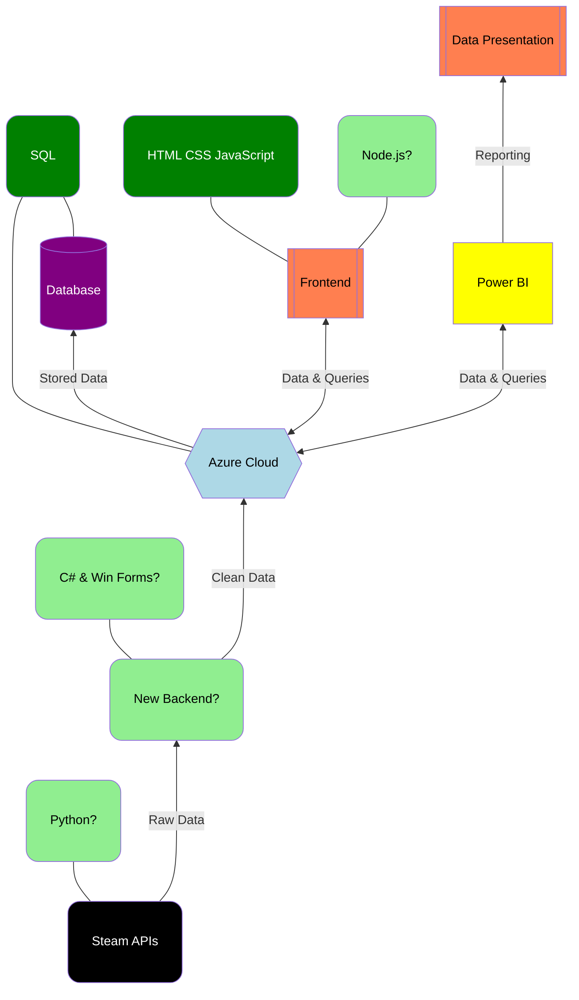

# Diagram

```mermaid
flowchart BT
  %% Define components
  A[Steam APIs]:::apiStyle
  B[New Backend?]:::ideaStyle
  C{{Azure Cloud}}:::cloudStyle
  D[(Database)]:::dbStyle
  E[[Frontend]]:::frontendStyle
  F[Power BI]:::biStyle
  G[[Data Presentation]]:::frontendStyle

  %% Define technologies
  T1[Python?]:::ideaStyle
  T2[C# & Win Forms?]:::ideaStyle
  T4[SQL]:::techStyle
  T5[HTML CSS JavaScript]:::techStyle
  T6[Node.js?]:::ideaStyle

  %% Diagram connections
  A --->|Raw Data| B
  B --->|Clean Data| C
  C --->|Stored Data| D
  C <--->|Data & Queries| E
  C <--->|Data & Queries| F
  F --->|Reporting| G
  
  %% Technology associations
  A --- T1
  B --- T2
  C --- T4
  D --- T4
  E --- T5
  E --- T6

  %% Apply custom styles
  classDef apiStyle fill:black, color:white, rx:15,ry:15, padding:15px;
  classDef backendStyle fill:blue, color:black, rx:15,ry:15, padding:15px;
  classDef cloudStyle fill:lightblue, color:black, rx:15,ry:15, padding:15px;
  classDef dbStyle fill:purple, color:white, rx:15,ry:15, padding:15px;
  classDef frontendStyle fill:coral, color:black, rx:15,ry:15, padding:15px;
  classDef biStyle fill:yellow, color:black, padding:15px;
  classDef ideaStyle fill:lightgreen, color:black, rx:15,ry:15, padding:15px;
  classDef techStyle fill:green, color:white, rx:15,ry:15, padding:18px;
```

# Color Key

- Black: External APIs
- Light Green: Ideas
- Light Blue: Server
- Purple: Database
- Coral: Frontend
- Green: Technologies
